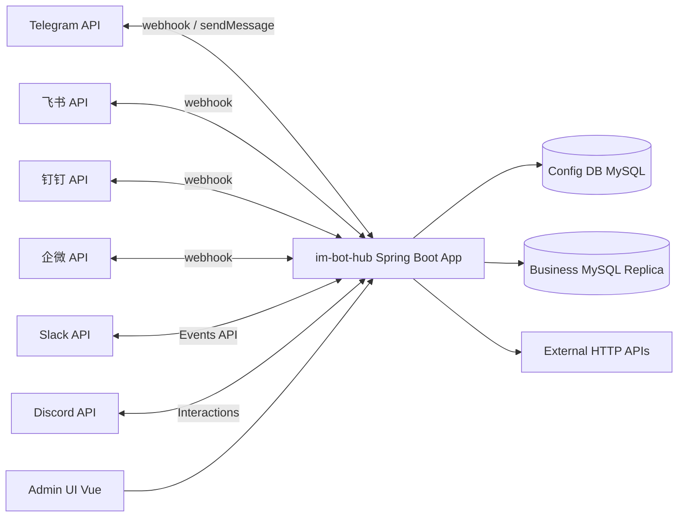
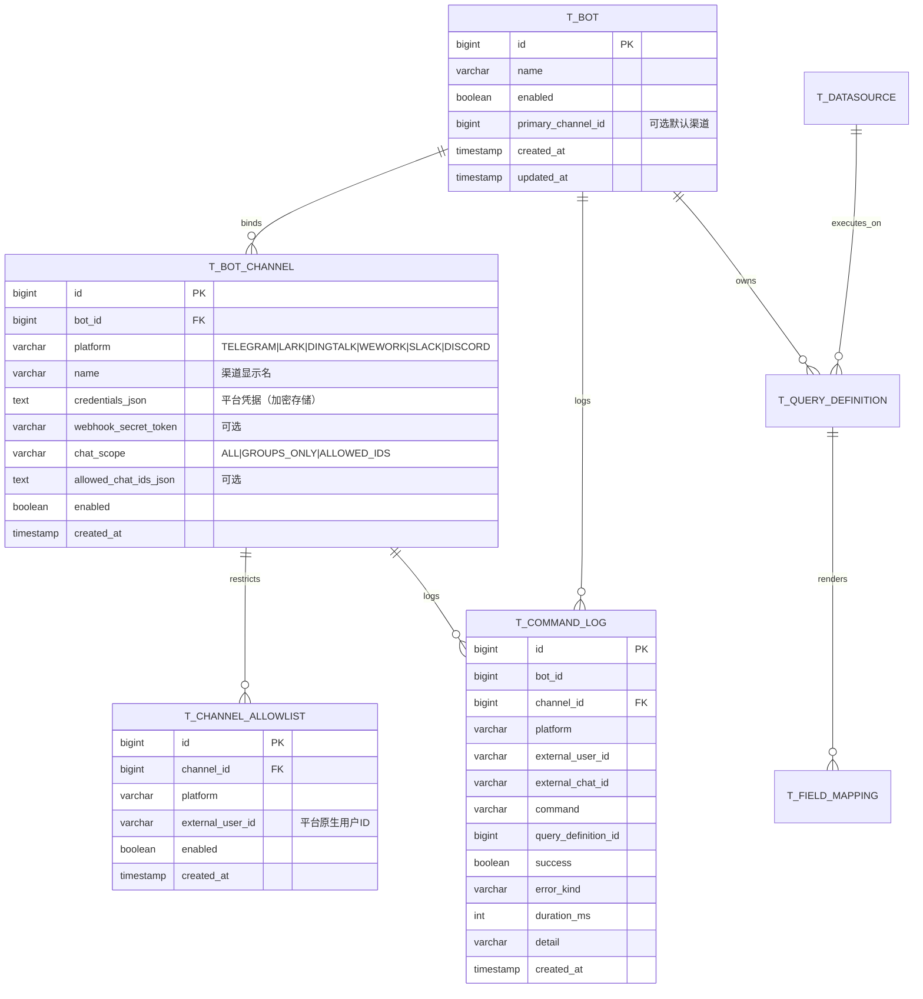
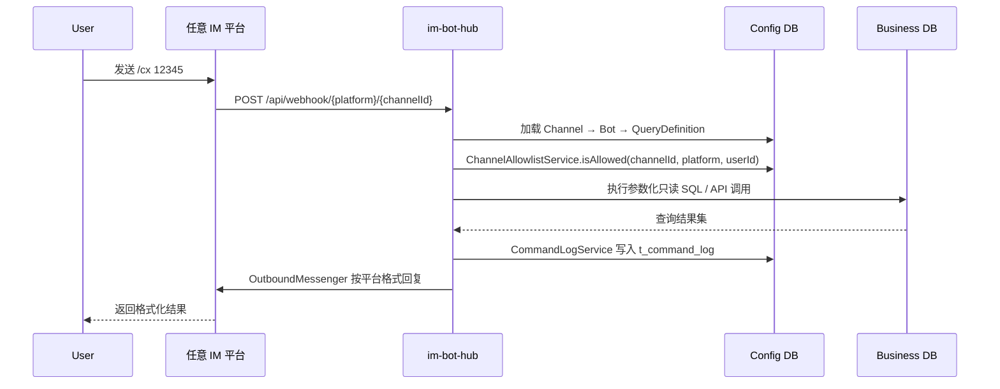

# 设计文档 V2（中英）/ Design Document V2 — im-bot-hub

> **维护约定**：凡影响架构、数据流、部署或安全边界的变更，须更新本节相关段落，并在变更记录追加一行，同步 `CHANGELOG.md`。

---

## 1. 目标与范围 / Goals & scope

**中文**

- **目标**：将 telegram-query-bot 重构为 `im-bot-hub`（通用 IM 查询机器人配置中心），实现 Bot-Channel 分离、通用白名单/日志、品牌重塑，并新增 Slack/Discord 接入。
- **非目标**：复杂多轮对话、跨库联邦、全文检索、移动端管理 App、多租户 SaaS。

**English**

- **Goals**: Refactor to `im-bot-hub` with Bot-Channel separation, generic allowlist/logging, branding rename, and Slack/Discord ingress.
- **Non-goals**: Conversational FSM, cross-DB federation, full-text search, mobile admin app, multi-tenant SaaS.

---

## 2. 逻辑架构 / Logical architecture



**中文**：各 IM 平台通过各自 Webhook 接入 `im-bot-hub`，配置库、业务只读库、管理端关系不变。  
**English**: All IM platforms ingress via their respective webhooks; config DB, business replica, and admin UI relationships unchanged.

---

## 3. 核心模型变更 / Core model changes

### 3.1 Bot-Channel 分离



### 3.2 与 V1 对比

| V1 表 | V2 变化 |
|-------|---------|
| `t_bot` | 移除 `telegram_bot_token` / `telegram_bot_username` / `telegram_chat_scope` / `telegram_allowed_chat_ids_json`；新增 `primary_channel_id` |
| `t_bot_channel` | 新增 `name` / `webhook_secret_token` / `chat_scope` / `allowed_chat_ids_json` |
| `t_user_allowlist` | deprecated，保留只读；新数据写入 `t_channel_allowlist` |
| `t_telegram_query_log` | deprecated，保留只读；新日志写入 `t_command_log` |
| `t_channel_allowlist` | **新增** |
| `t_command_log` | **新增** |
| 其余表 | 不变 |

---

## 4. 数据流（Webhook）/ Data flow (webhook)



**关键变更**：Webhook 路径从 `/{botId}` 改为 `/{platform}/{channelId}`（Telegram 保持 `/{botId}` 兼容），凭据从 Channel 加载。

---

## 5. 后端包结构（重构后）/ Backend package structure

```
com.sov.imhub
├── TelegramQueryBotApplication.java → ImBotHubApplication.java
├── config/
│   ├── AppConfig.java
│   ├── AppProperties.java
│   └── SecurityConfig.java
├── domain/
│   ├── Bot.java                     (纯通用：name, enabled, primaryChannelId)
│   ├── BotChannelEntity.java        (增强：name, webhookSecretToken, chatScope, ...)
│   ├── ChannelAllowlistEntity.java  (新增)
│   ├── CommandLogEntity.java        (新增)
│   ├── DatasourceEntity.java
│   ├── QueryDefinitionEntity.java
│   ├── FieldMappingEntity.java
│   ├── ImPlatform.java              (扩展：+SLACK, +DISCORD)
│   └── ...
├── mapper/
│   ├── ChannelAllowlistMapper.java  (新增)
│   ├── CommandLogMapper.java        (新增)
│   └── ...
├── service/
│   ├── QueryOrchestrationService.java  (去 TG 耦合)
│   ├── CommandLogService.java          (新增，替代 TelegramQueryLogService)
│   ├── ChannelAllowlistService.java    (新增)
│   ├── ChannelCredentialResolver.java  (新增)
│   ├── FieldRenderService.java
│   ├── WebhookDispatchService.java     (Channel 驱动)
│   ├── im/
│   │   ├── ImCommandText.java
│   │   └── InboundCommandContext.java  (通用化)
│   ├── telegram/ (保留，仅 Telegram 特有逻辑)
│   ├── lark/
│   ├── dingtalk/
│   ├── wework/
│   ├── slack/       (新增)
│   └── discord/     (新增)
├── im/ (出站 Messenger)
│   ├── OutboundMessenger.java
│   ├── TelegramOutboundMessenger.java
│   ├── LarkOutboundMessenger.java
│   ├── DingTalkOutgoingMessenger.java
│   ├── WeWorkOutboundMessenger.java
│   ├── SlackOutboundMessenger.java    (新增)
│   └── DiscordOutboundMessenger.java  (新增)
├── web/
│   ├── TelegramWebhookController.java   (兼容保留)
│   ├── LarkWebhookController.java
│   ├── DingTalkWebhookController.java
│   ├── WeWorkWebhookController.java
│   ├── SlackWebhookController.java      (新增)
│   ├── DiscordWebhookController.java    (新增)
│   └── admin/
│       ├── AdminBotController.java       (DTO 去 TG)
│       ├── AdminBotChannelController.java (增强)
│       ├── AdminCommandLogController.java (新增，替代 TG log)
│       └── ...
└── admin/dto/
    ├── BotCreateRequest.java        (去 TG 字段)
    ├── BotResponse.java             (去 TG 字段)
    ├── CommandLog*.java             (新增)
    └── ...
```

---

## 6. 安全边界 / Security

**中文**

- **凭据加密**：`t_bot_channel.credentials_json` 建议 AES-GCM 加密（复用 `EncryptionService`）。
- **Webhook Secret**：Telegram/X-Telegram-Bot-Api-Secret-Token、Slack Signing Secret、Discord Public Key 各平台验证逻辑不变。
- **白名单**：统一为 `t_channel_allowlist`，检查逻辑按平台适配。
- **日志**：`t_command_log` 不记录业务参数值和凭钥。
- **管理端**：`/api/admin/**` Basic 认证不变。
- **SQL 安全**：参数化绑定不变。

**English**

- Credentials in `t_bot_channel.credentials_json` with optional AES-GCM encryption.
- Per-platform webhook secret verification unchanged.
- Unified allowlist in `t_channel_allowlist` with platform-adapted checks.
- `t_command_log` never stores business param values or secrets.
- Admin API Basic auth unchanged.
- SQL parameter binding unchanged.

---

## 7. 设计变更记录 / Design change log

| 日期 Date | 摘要（中文） | Summary (EN) |
|-----------|----------------|----------------|
| 2026-05-01 | V2 设计文档首版：Bot-Channel 分离、通用白名单/日志、包名重命名、新平台接入 | V2 initial design: Bot-Channel separation, generic allowlist/logging, package rename, new platforms |
