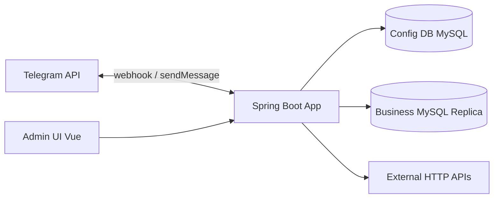
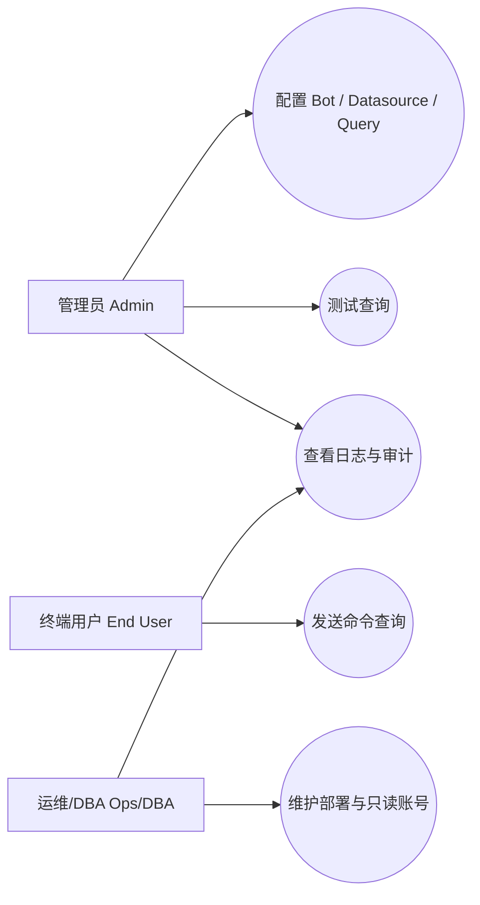
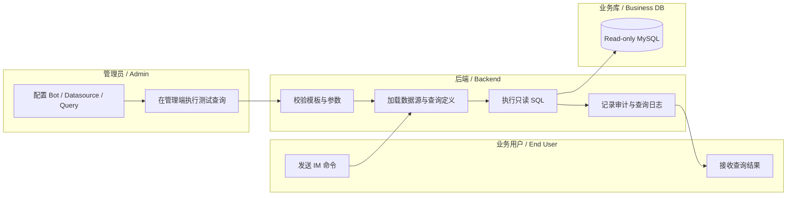
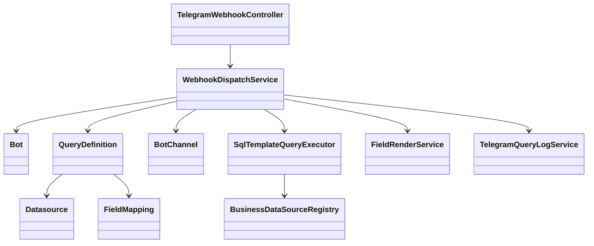
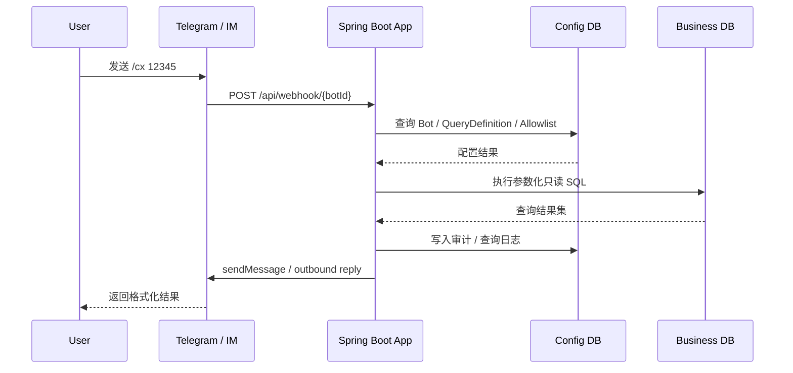
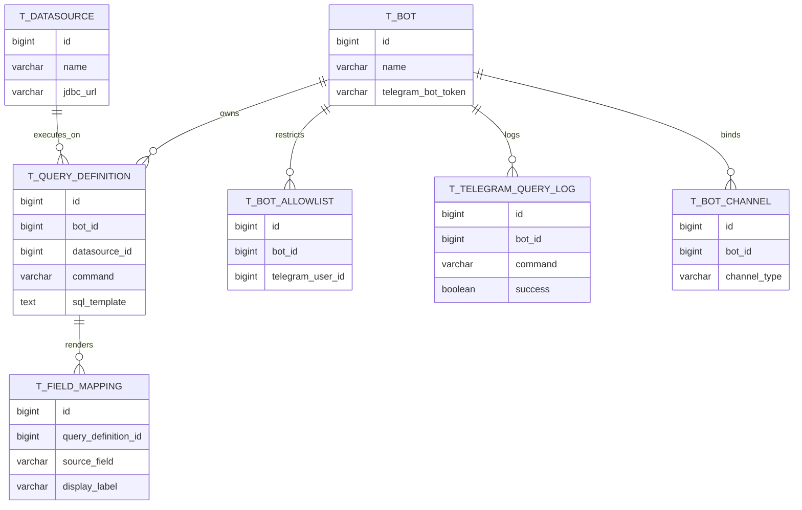
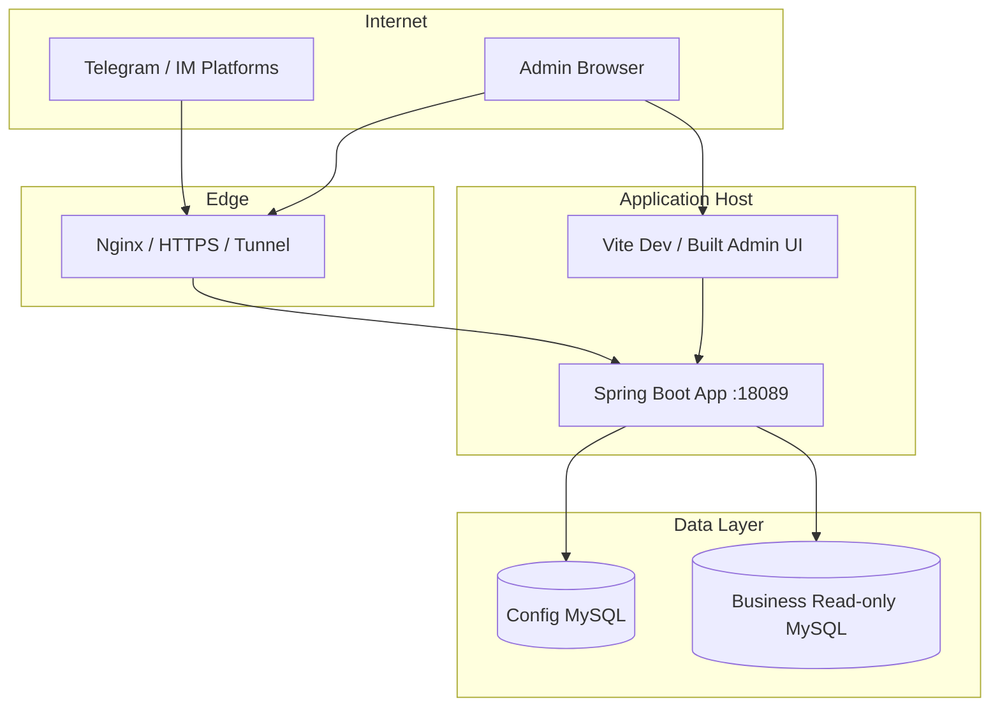

# 设计文档（中英）/ Design Document — telegram-query-bot

> **维护约定（中文）：** 凡影响架构、数据流、部署或安全边界的变更，须更新本节相关段落，并在第七节「变更记录」追加一行，并同步 `CHANGELOG.md`。  
> **Maintenance (English):** Update this document and the change log (section 7) for architecture, data flow, deployment, or security boundary changes; sync `CHANGELOG.md`.

---

## 1. 目标与范围 / Goals & scope

**中文**

- **目标：** 支持多个 Telegram 机器人；用户命令（如 `/cx`）映射为 **参数化只读 SQL** 或第三方 **API**；按配置输出字段标签、顺序与脱敏；管理端维护机器人、数据源、查询定义、字段映射与白名单。  
- **非目标（首版）：** 复杂多维检索、全文检索、跨库联邦；复杂多轮会话状态机。

**English**

- **Goals:** Multi-bot Telegram gateway; **parameterized read-only SQL** or external **API** requests; field mapping/masking; admin CRUD for bots/datasources/queries/allowlist.  
- **Non-goals (v1):** ad-hoc analytics, full-text, cross-DB federation, complex conversational FSM.

---

## 2. 逻辑架构 / Logical architecture

**中文：** Telegram 与 **配置库**、**业务只读库**、**管理端** 的关系见上图。  
**English:** Telegram, config DB, business replica, and admin UI as above.

- **配置库 / Config DB：** Bots、Datasources、QueryDefinitions、FieldMappings、Allowlist、AuditLog、**TelegramQueryLog**（用户斜杠命令处理记录，不落业务参数值）。  
- **业务库 / Business DB：** 只读副本（可多个），由 `Datasource` 配置驱动连接池。

### 2.1 用例图 / Use-case diagram

### 2.2 泳道图 / Swimlane

### 2.3 类图 / Class diagram

### 2.4 时序图 / Sequence diagram

### 2.5 ER 图 / ER diagram

### 2.6 部署图 / Deployment diagram

---

## 3. 核心模块 / Core modules

| 模块 Module | 职责（中文） | Responsibility (EN) |
|-------------|----------------|---------------------|
| `TelegramWebhookController` + `WebhookDispatchService` | 解析 Update、白名单、限流、执行查询、渲染回复 | Parse updates, allowlist, rate limit, execute query, render reply |
| `BusinessDataSourceRegistry` | 仅为数据库型 `Datasource` 按 `Datasource.id` 管理 Hikari 池、热更新 | Hikari pools and hot reload only for database datasources |
| `SqlTemplateQueryExecutor` + `SqlTemplateValidator` | `#{param}`→命名参数 JDBC、模板校验 | Bind parameters, validate templates |
| `ApiDatasourceSupport` + `ApiQueryConfigService` | API 数据源校验、鉴权、预览、JSON 字段发现、API 结果转统一行结构 | API datasource validation, auth, preview, field discovery, API result to normalized rows |
| `FieldRenderService` | 按 FieldMapping 渲染 Telegram HTML | Render Telegram HTML from mappings |
| `EncryptionService` | 可选 AES-GCM 加密数据源密码 | Optional AES-GCM for datasource secrets |
| `TelegramQueryLogService` + `t_telegram_query_log` | Webhook 成功/失败路径写审计行；管理端分页查询 | Persist Telegram command outcomes; admin paged API |
| `VisualQuerySqlGenerator` | 向导 JSON 生成 `sql_template`；**OR** 或 **SQL `UNION`（去重）** 多列关键词（`orCompositionStrategy` 仍为 `UNION_ALL`）；**固定 INT/BOOL AND**；分支 `LIMIT` 与外层 `max_rows` 配合 | Wizard SQL; LEGACY_OR vs multi-branch UNION distinct; fixed literal AND; per-branch LIMIT + outer cap |
| `DatasourceMetadataService` | 元数据表列；**`information_schema` 表行估算**；可选 **`COUNT(*)`**（超时）；**`SHOW INDEX`** 名称列表（索引建议用） | Table/column metadata; row estimate; optional exact count; index names |
| `VisualQueryBenchmarkService` | 管理端对**未保存**向导 JSON 编译 **OR** 与 **UNION_ALL** 各执行 2 次取平均耗时（只读库）；审计不落参数值 | Admin benchmark alternating runs; audit without param values |
| `VisualQueryIndexAdviceService` | 根据向导列**启发式**生成 **`CREATE INDEX` 文本**，**从不执行 DDL**；提示主库执行 | Heuristic index DDL strings only; never execute |
| `admin-ui` | 管理 CRUD、SQL/API 可视化配置、测试查询入口 | Admin CRUD, visual SQL/API configuration, and test queries |

### 3.1 向导 OR / UNION 与辅助 API / Visual OR, UNION, helper APIs

**中文：** `visual_config_json.orCompositionStrategy` 为 `LEGACY_OR`（默认）或 `UNION_ALL`（JSON 名未改）；`UNION_ALL` 在 **`searchOrColumns` ≥ 2** 时生成多支 **`UNION`**（SQL 默认去重，与多列 OR 结果更接近；较 `UNION ALL` 可能更耗资源）；全局仍受 **`max_rows`** 限制。`GET .../metadata/tables/{table}/stats` 提供 `TABLE_ROWS` 与可选 **`exactCount`**（JDBC 超时）。`POST .../visual-query/benchmark` 对未保存 JSON 交替执行 OR / 多支 UNION 各 2 次取平均；审计 **`VISUAL_BENCHMARK`** 不写业务参数。`POST .../index-advice` 仅返回 **`CREATE INDEX`** 文本。**`SqlTemplateValidator`** 允许单语句内的 **`UNION`** / **`UNION ALL`**（仍以 `SELECT` 开头、禁多语句）。

**English:** `UNION_ALL` strategy emits SQL **`UNION`** (distinct) across branches when **≥2** `searchOrColumns`; **`max_rows`** still applies. Stats / benchmark / index advice as above; validator allows **`UNION`** and **`UNION ALL`** inside one SELECT-shaped template.

---

## 4. 数据流（Webhook）/ Data flow (webhook)

**中文**

1. 入口（其一即可）：Telegram → `POST /api/webhook/{botId}`；飞书 → `POST /api/webhook/lark/{channelId}`；钉钉 Outgoing → `POST /api/webhook/dingtalk/{channelId}`；企业微信 → `GET|POST /api/webhook/wework/{channelId}`（XML/AES）。  
2. 加载 `Bot`、`QueryDefinition`（命令匹配）；IM 渠道凭据见 `t_bot_channel`（可选 `enc:v1` 密文）。  
3. 白名单：**仅 Telegram** 校验 `telegram_user_id`；其它 IM 当前不做用户白名单。  
4. 若无匹配的 `QueryDefinition` 且命令为 `help`/`start`，返回内置命令列表（与已配置同名命令冲突时以 `QueryDefinition` 为准）  
5. 若查询模式为 SQL / VISUAL，则使用 `NamedParameterJdbcTemplate` 执行模板；若为 API，则按数据源与查询配置调用外部 HTTP API。  
6. SQL 结果集或 API JSON 结果统一转换为行结构，交由 `FieldMapping` / `FieldRenderService` 处理。  
7. `FieldMapping` 格式化 → 各平台 `OutboundMessenger`（Telegram HTML、飞书/钉钉纯文本、企微加密 XML 等）

**English**

1. Ingress: Telegram `POST /api/webhook/{botId}`; Lark `POST /api/webhook/lark/{channelId}`; DingTalk Outgoing `POST /api/webhook/dingtalk/{channelId}`; WeCom `GET|POST /api/webhook/wework/{channelId}`.  
2. Load `Bot`, `QueryDefinition`; IM credentials in `t_bot_channel` (optional `enc:v1`).  
3. Allowlist: **Telegram only** today.  
4. Built-in `help`/`start` when no matching definition (same-name definitions win).  
5. Execute template via `NamedParameterJdbcTemplate` (multi-row up to `max_rows`).  
6. `FieldMapping` → platform `OutboundMessenger`.

---

## 5. 安全边界 / Security

**中文：** 管理端 `/api/admin/**` + Basic（生产须强密码与 HTTPS）。Webhook 为公开接口；依赖内部 `botId`、限流、白名单；**可选**在 `t_bot.webhook_secret_token` 配置后校验请求头 `X-Telegram-Bot-Api-Secret-Token`。SQL 模板仅允许「类 SELECT」；值一律绑定参数。API 模式支持 Bearer / Basic / API Key 等鉴权，但密钥值只能走密文存储或临时明文输入测试，不得进入日志。**Telegram 查询日志**仅记录命令名、用户/会话 ID、结果类型与耗时等，**不记录**业务查询参数值与 API 密钥；向导 **固定条件** 仅允许 **INT/BOOL 字面量** 写入生成 SQL，比较符为 **等于（默认）** 或 **不等于（`operator: NE`）**，禁止用户可控字符串字面量以防注入。  
**English:** Admin uses Basic + HTTPS in prod; webhook is public—protect with `botId`, rate limits, allowlist; optional per-bot `webhook_secret_token` vs header `X-Telegram-Bot-Api-Secret-Token`. SQL templates are SELECT-like only; values are always bound. API mode supports bearer/basic/API-key auth, but secrets must never leak into logs. **Telegram query logs** store command names and ids, not business param values or API secrets. **Visual fixed predicates** allow only INT/BOOL literals, with **equality (default)** or **`NE` not-equal**; no user-controlled string literals in generated SQL.

---

## 6. 可扩展性 / Extensibility

**中文：** 新命令→新增 `QueryDefinition`；新机器人→新增 `Bot` 与绑定；新展示列→`t_field_mapping`。当前同一套查询定义既支持数据库也支持 API，新增外部能力优先通过“数据源类型 + 查询模式”扩展，而不是复制一套平行子系统。Webhook 密钥已支持；多实例限流外置（如 Redis）与异步发送仍为后续项，见 `deploy/README-HORIZONTAL.md`。**`t_telegram_query_log`** 可按时间与机器人等维度增长，生产环境建议制定保留策略（可参考 `scripts/mysql/03-purge-telegram-query-log.sql` 由 DBA 分批清理）。  
**English:** New commands via `QueryDefinition`; bots via `Bot`; display via `t_field_mapping`. The same query-definition pipeline now supports both database and API execution paths, extending by datasource type and query mode instead of duplicating a parallel subsystem. Webhook secret supported; Redis/async sending remain future cross-cuts (see `deploy/README-HORIZONTAL.md`). **`t_telegram_query_log`** should have a retention policy in production (see optional purge SQL under `scripts/mysql/`).

### 6.1 需求与交付约束 / Requirements and delivery constraints

**中文**

- 本项目后续交付默认需要同时考虑：**用户体验、技术债控制、详细文档、自动测试、中文提交信息、变更记录同步**。
- 中大型功能应在编码前具备至少一份需求分析或 PRD，并在实现后同步更新测试与设计文档。
- 文档体系建议包括：`README`、`CHANGELOG`、`WORKFLOW`、`CODING-STANDARD`、`DESIGN`、PRD、需求分析、测试策略/说明。

**English**

- Future delivery should account for **UX, debt control, detailed documentation, automated testing, Chinese commit messages, and changelog updates**.
- Medium and large features should have at least a requirements or PRD document before coding, with synchronized design/test docs after implementation.
- Recommended doc system: `README`, `CHANGELOG`, `WORKFLOW`, `CODING-STANDARD`, `DESIGN`, PRD, requirements analysis, and testing strategy.

---

## 7. 设计变更记录 / Design change log

| 日期 Date | 摘要（中文） | Summary (EN) |
|-----------|----------------|----------------|
| 2026-04-18 | 首版架构与流程文档；仓库文档统一为中文或中英对照 | Initial design + workflow docs; repo docs are Chinese or bilingual |
| 2026-04-18 | 增补 MCP MySQL 测试说明与 DBA 建库脚本 `scripts/mysql/` | Added MCP MySQL test notes and admin SQL under `scripts/mysql/` |
| 2026-04-18 | 管理端 `admin-ui` 支持查询定义编辑/删除与字段映射 CRUD，与设计 §3 一致 | Admin UI supports query edit/delete and field-mapping CRUD per §3 |
| 2026-04-18 | 优化实施：Webhook Secret 头校验与 `webhook_secret_token`；审计分页与索引；限流 Caffeine 淘汰；白名单单条 SQL；用户提示中文化；`app.cors`；GitHub CI；数据源 PUT；Testcontainers 启动测试；横向扩展说明 | Plan delivery: webhook secret, audit page+index, Caffeine buckets, allowlist SQL, Chinese TG copy, CORS config, CI, datasource PUT, TC smoke test, scaling doc |
| 2026-04-19 | SpringDoc 默认 `/v3/api-docs` 与文档/Nginx 对齐；出站 `RestClient` 单例；业务库 `NamedParameterJdbcTemplate` 按数据源缓存；Telegram `/help` `/start` 与多行结果渲染；部署 Webhook 密钥检查清单 | Align OpenAPI on `/v3/api-docs`; singleton RestClient; cached NamedParameterJdbc per datasource; `/help` `/start` + multi-row replies; webhook secret deploy checklist |
| 2026-04-19 | `t_telegram_query_log` 与 Webhook 写入；管理端查询日志 API；向导 `fixedPredicates`（INT/BOOL）；向导 UI 穿梭框与折叠 | Telegram query log table + admin API; visual fixed predicates; transfer + collapse wizard UI |
| 2026-04-19 | Telegram 查询日志 API/UI：`errorKind`、`success`、时间、`telegramUserId`、`chatId` 筛选；`scripts/mysql/03-purge-telegram-query-log.sql` 清理示例 | TG log filters + optional purge SQL |
| 2026-04-19 | 向导：`orCompositionStrategy`（OR / UNION ALL）、表 `stats` 与精确 `COUNT`、**benchmark** 与**索引建议 DDL**（不执行）；`SqlTemplateValidator` 允许 `UNION ALL` | Visual OR vs UNION_ALL; table stats + benchmark + index DDL text; validator UNION ALL |
| 2026-04-19 | 多 IM：`t_bot_channel` 飞书/钉钉/企微 Webhook；`QueryOrchestrationService` + `OutboundMessenger`；企微 AES 被动回复；渠道凭据可选全局 AES 封装 | Multi-IM channels (Lark/DingTalk/WeCom), orchestration, optional credential encryption |
| 2026-04-24 | 补全文档体系：新增 PRD、需求分析、测试策略文档；设计文档新增用例图、泳道图、类图，以及交付约束说明 | Expanded doc system with PRD, requirements, testing strategy, use-case/swimlane/class diagrams, and delivery constraints |
| 2026-04-24 | 补充自动化与设计细节：新增文档检查/质量门禁/交付脚本；设计文档新增时序图、ER 图、部署图 | Added doc-check/quality-gate/delivery scripts and sequence/ER/deployment diagrams |
| 2026-04-24 | 数据源与查询体系扩展为数据库/API 双模式；新增 API 鉴权、连通性测试、JSON 预览与字段映射流程 | Extended datasources and queries to database/API dual mode with auth, connectivity test, JSON preview, and field mapping |
| 2026-04-25 | Telegram `setMyCommands`：菜单副标题用查询侧名称（API `name` / 向导表名 / SQL `命令·数据源`）；`param_schema` 含 `examples`；无参点菜单时用法提示。管理端《使用说明》与工作台折叠引导与三模式对齐 | Telegram menu labels + examples + usage hint on bare `/cmd`; admin UserGuide + Dashboard hints aligned with SQL/visual/API |
| 2026-04-25 | `TELEGRAM-傻瓜配置.md` 全文重排：12 节目录、数据源分库/API、Webhook 单线叙述、接收范围与群内用法合并 | Rewrote Telegram operator doc: TOC, 12 sections, split DS types, unified Webhook chapter, merged scope + group tips |
| 2026-04-25 | `setMyCommands` 增加 **`scope=all_group_chats`** 二次写入，与默认范围共用同一命令列表，缓解群内 `/` 联想不完整 | Second `setMyCommands` call for `all_group_chats` scope alongside default |
